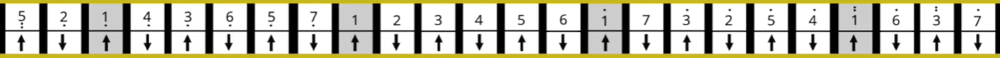
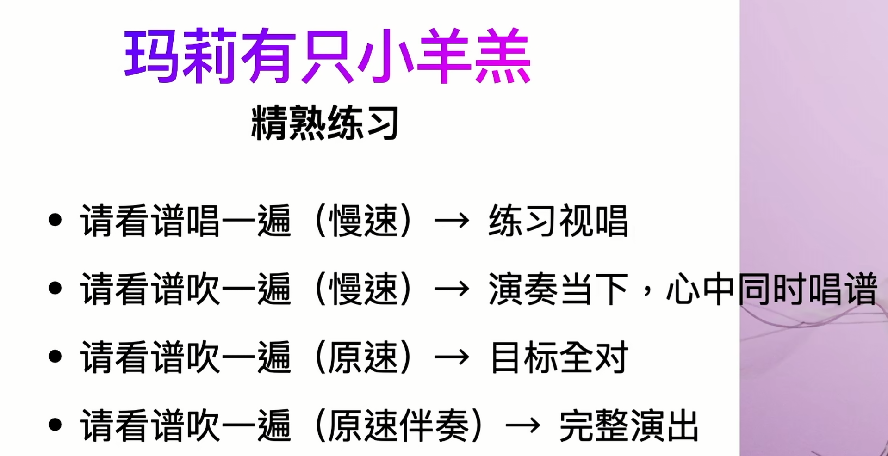

多多发展兴趣爱好~

## 认识口琴



记住: **1 3 5吹** , **2 4 6 7吸**

曲谱的符号解释：- 的意思是拉长音，吸------ 吹------

关键：**吹吸对节奏，移动对吹吸**

## 第一支曲子~ 玛莉有只小羊羔

### 玛莉有只小羊羔谱

```js
3 2 1 2 3 3 3 -
2 2 2 - 3 3 3 -
3 2 1 2 3 3 3 -
2 2 3 2 1 - 0 0
```

### 玛莉有只小羊羔练习

唱谱：用嘴巴跟着谱子的节奏“空吹”



## 小星星~

### 小星星谱

```js
1 1 5 5 6 6 5 -
4 4 3 3 2 2 1 -
5 5 4 4 3 3 2 -
5 5 4 4 3 3 2 -
1 1 5 5 6 6 5 -
4 4 3 3 2 2 1 -
```
