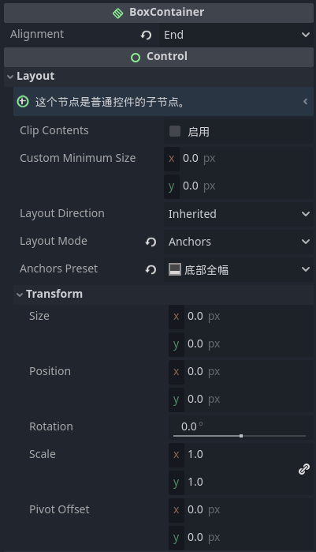
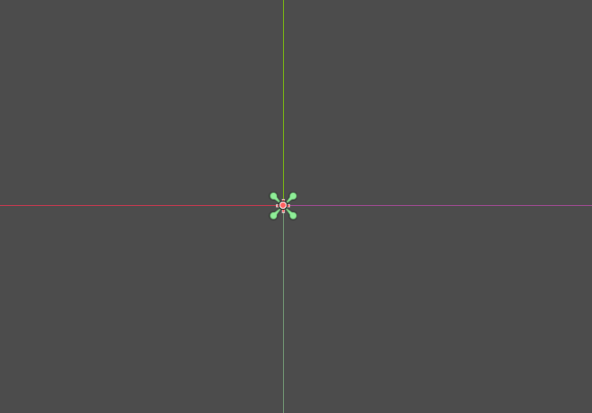

## 问题描述

在使用Godot原生的TextureButton时, 如果hover和normal的图片尺寸不一致时, 会导致hover后图片位置偏移的很严重, 但又没有很完美的方法微调, 所以现在自行实现一下

## 节点树结构

```python
GoLevelButton # 按钮
└──VBoxContainer # 锁住图片的位置
  └──NormalTexture
  └──HoverTexture
```

`VBoxContainer设置`:



我们不预先设置节点的尺寸,全部置零再全部居中



在代码里设置按钮的大小:

为了在场景中能实时看到实际赋值的图片, 注意使用@tool修饰符

```js

@tool
extends BaseButton

@export var level_index: int

@export var texture_normal: Texture2D:
	set(value):
		if (value):
			texture_normal = value
			queue_redraw()

@export var texture_hover: Texture2D:
	set(value):
		if (value):
			texture_hover = value
			queue_redraw()

@onready var normal_texture: TextureRect = $VBoxContainer/NormalTexture
@onready var hover_texture: TextureRect = $VBoxContainer/HoverTexture

func _draw() -> void:
	if (texture_normal):
		normal_texture.texture = texture_normal

	if (texture_hover):
		hover_texture.texture = texture_hover

func _ready() -> void:
	if (not texture_normal):
		return
	size.x = texture_normal.get_width()
	size.y = texture_normal.get_height()

func _on_v_box_container_mouse_entered() -> void:
	normal_texture.hide()
	hover_texture.show()


func _on_v_box_container_mouse_exited() -> void:
	normal_texture.show()
	hover_texture.hide()


func _on_pressed() -> void:
	GlobalSignal.go_level_index.emit(level_index)

```
