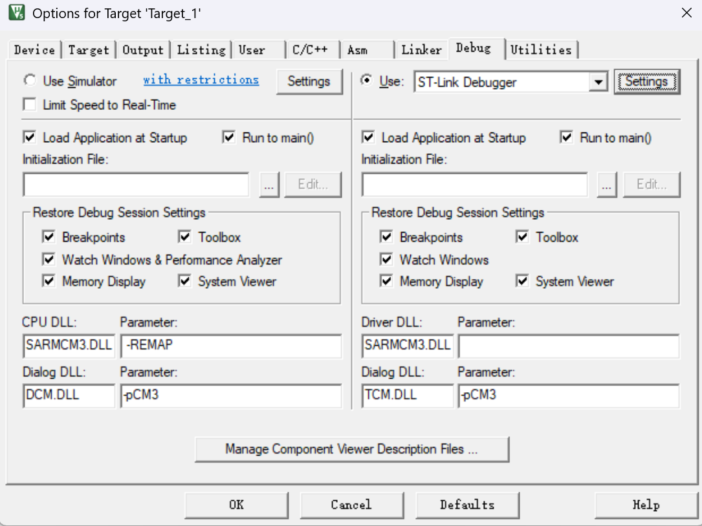
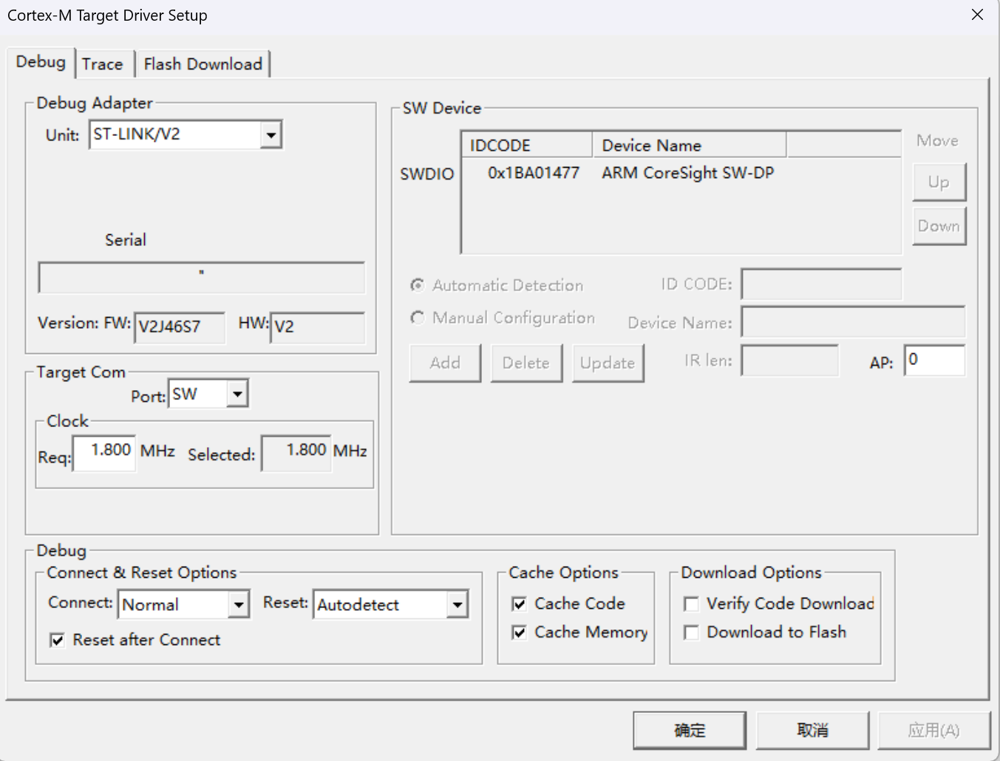
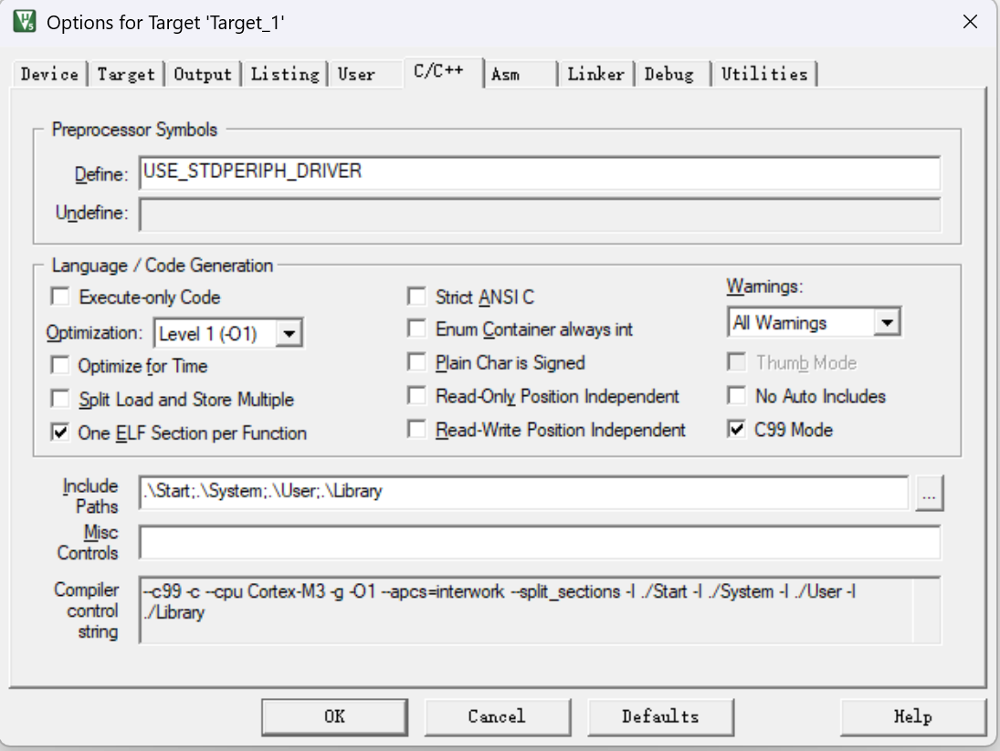
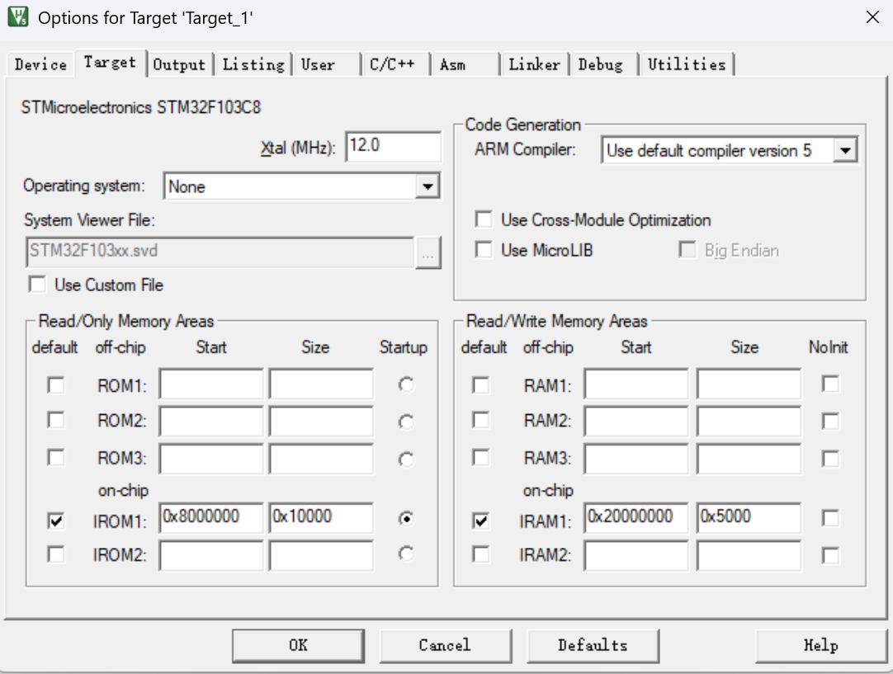

## 破解软件

下载互联网上的 [keygen2032](../../assets/STM32项目初始化配置/keygen2032.rar)

注：**该软件来自互联网与本站无关，仅供学习交流使用，必须在下载的24小时内完全删除该软件，请支持正版**

## 新建项目

`Project-New Project`，项目文件命名为`Project`

## 新建Start文件夹

- 将`固件库\STM32F10x_StdPeriph_Lib_V3.5.0\Libraries\CMSIS\CM3\DeviceSupport\ST\STM32F10x\startup\arm`里的文件都复制进来

- 将`固件库\STM32F10x_StdPeriph_Lib_V3.5.0\Libraries\CMSIS\CM3\DeviceSupport\ST\STM32F10x`里的`stm32f10x.h` 、`system_stm32f10x.c` 、`system_stm32f10x.h`文件复制进来

- 将`固件库\STM32F10x_StdPeriph_Lib_V3.5.0\Libraries\CMSIS\CM3\CoreSupport`里的`core_cm3.c` 、`core_cm3.h`文件复制进来

最后在Keil里创建Start组，把Start文件夹下的`startup_stm32f10x_md.s`和`*.c`与`*.h`文件添加进来

## 新建Library文件夹

- 将`固件库\STM32F10x_StdPeriph_Lib_V3.5.0\Libraries\STM32F10x_StdPeriph_Driver\src`里的所有文件复制进来

- 将`固件库\STM32F10x_StdPeriph_Lib_V3.5.0\Libraries\STM32F10x_StdPeriph_Driver\inc`里的所有文件复制进来

最后在Keil里创建Library组，把Library文件夹下的所有文件都添加进来

## 添加User文件夹

- 将`固件库\STM32F10x_StdPeriph_Lib_V3.5.0\Project\STM32F10x_StdPeriph_Template`里的
  `stm32f10x_conf.h` 、`stm32f10x_it.c`和`stm32f10x_it.h`复制进来
- 新建`main.c`文件

最后在Keil里创建User组，把User文件夹下的所有文件都添加进来

## 添加头文件路径

不要忘了添加头文件路径：`魔术棒按钮`-`C/C++`-`Include Paths`

## 配置ST Link

## 配置C/C++的define

`C/C++ - Preprocessor Symbols`

`USE_STDPERIPH_DRIVER`

## 选择编译器版本

`Target-Code Generation`

