## 01-前言之物理意义--数字和字母的灵魂

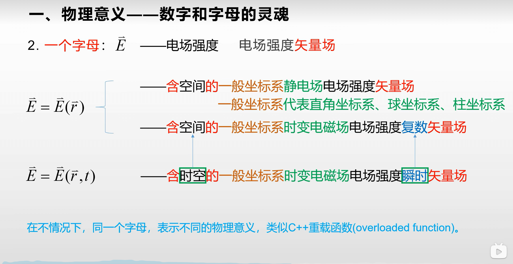

## 03-场就是函数之矢量函数无处不函数思想

重点：**矢量函数的写法、矢量函数会通过标量函数来研究**

建立无处不函数的思想

## 03-场就是函数之场的概念

### 1.场的定义

给定空间的点和时间上的时刻，都有一个确定的物理量与之相对应，则称此区域此时刻确定了该物理量的场

感悟：这就是函数的定义（设在一个变化过程中有两个变量 x 和 y，如果对于 x 的每一个值，y 都有唯一确定的值与之对应，那么就说 y 是 x 的函数，x 是自变量。），因此说场就是函数，是关于空间和时间的函数，是加了物理单位的函数

### 2.场的分类

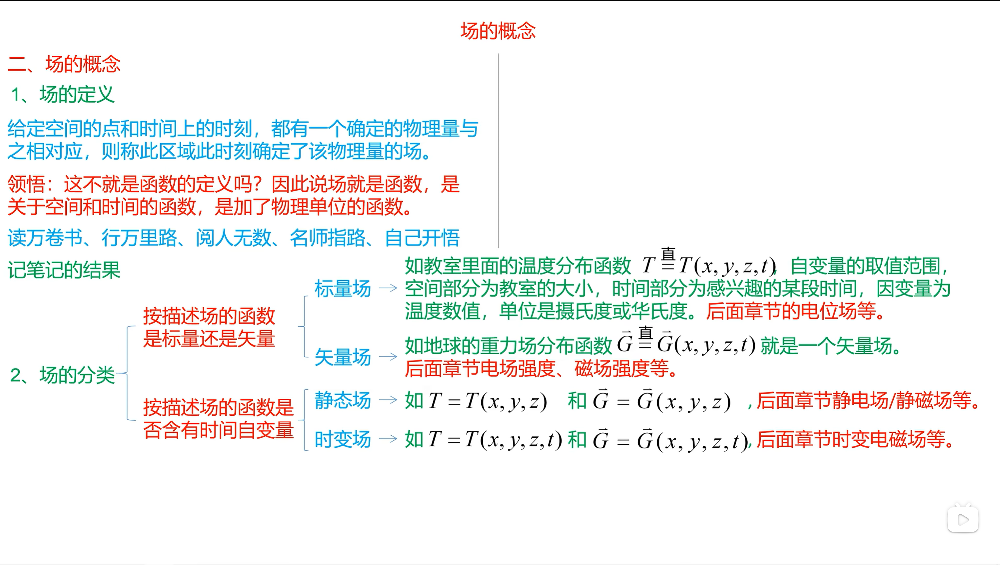

根据描述场的函数是标量还是矢量、根据描述场的函数是否含有时间自变量

静态标量场、静态矢量场
时变标量场、时变矢量场

一定要清楚的认识到标量是没有方向这句话，也就是没有方向的变量是标量

### 3.电磁场的定义

电磁场：电磁函数
电磁波：电磁函数

电磁场与电磁波=电磁函数与电磁函数->物理数学与物理数学=物理数学

所以电磁场就是物理和数学，学的时候遇到不会的就查、就学

## 04-熟悉的抽象-矢量运算之加减法

矢量运算：矢量加法、矢量减法、矢量点乘、矢量叉乘、矢量混合积

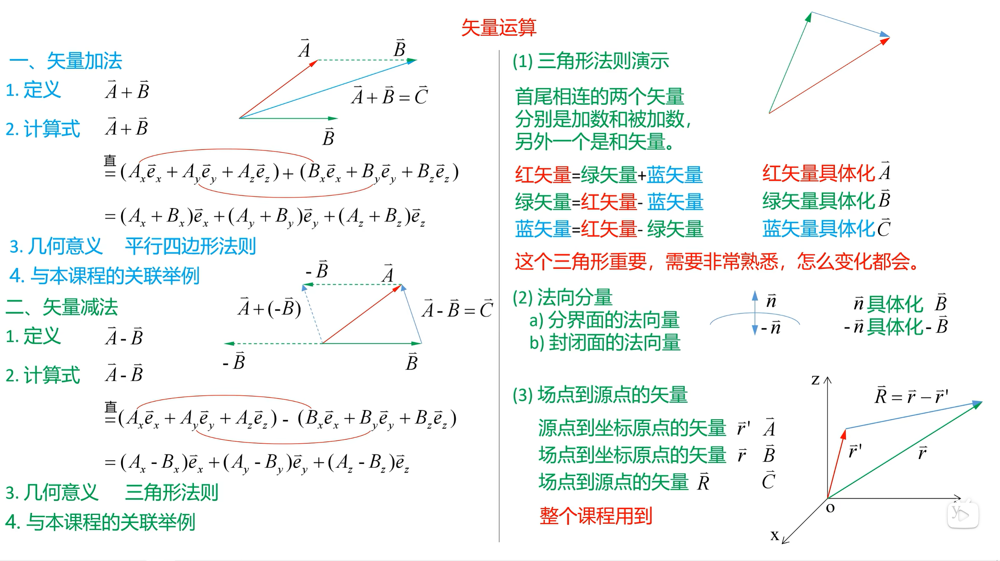

矢量减法的应用：场点到源点的矢量

## 04-熟悉的抽象-矢量运算之点乘

点乘的结果是标量
点乘满足交换律

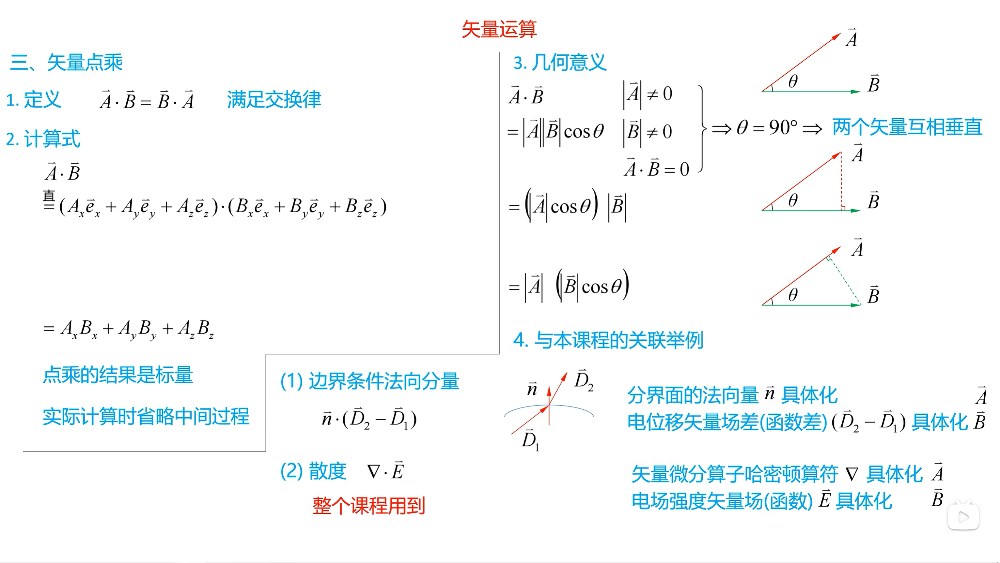

## 04-熟悉的抽象-矢量运算之叉乘

叉乘的结果是矢量：可以用右手螺旋定则判断结果的方向（A叉乘B，就把手心对着B）
叉乘不满足交换律

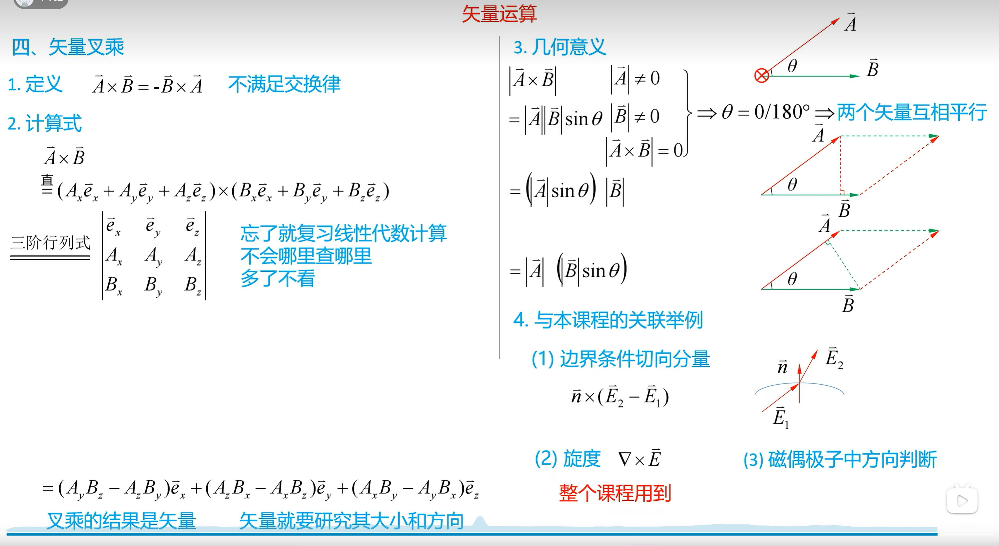

## 04-熟悉的抽象-矢量运算之混合积

先算叉乘再算点乘

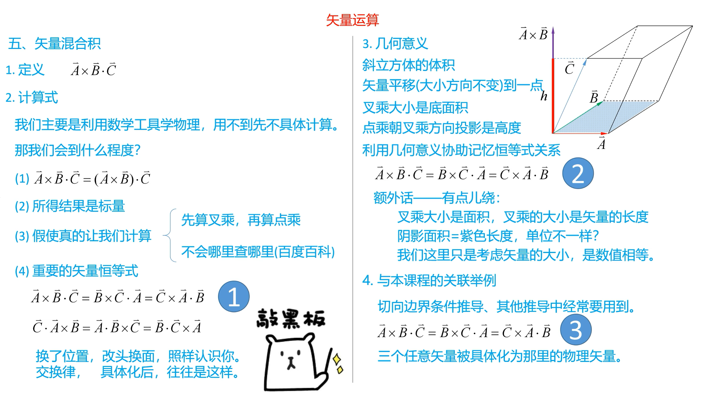

## 04思维导图

[思维导图](https://www.bilibili.com/video/BV1uV411H7xf?p=15)

## 05-场的分析方法概要

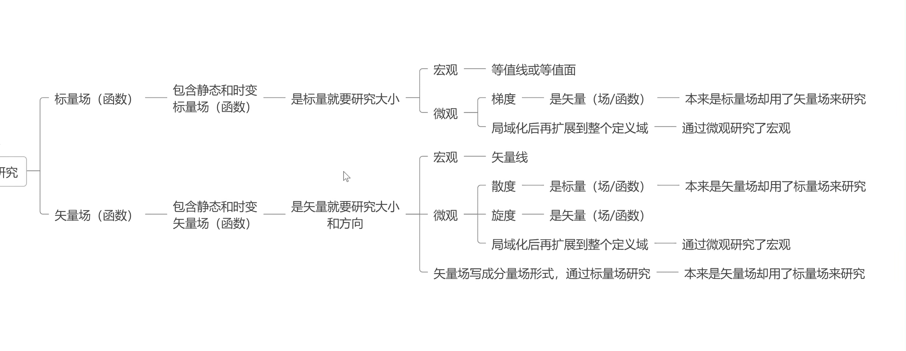

## 06-场的宏观分析之标量场的等值面

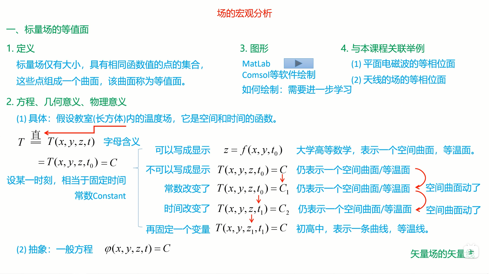

## 06-场的宏观分析之矢量场的矢量线

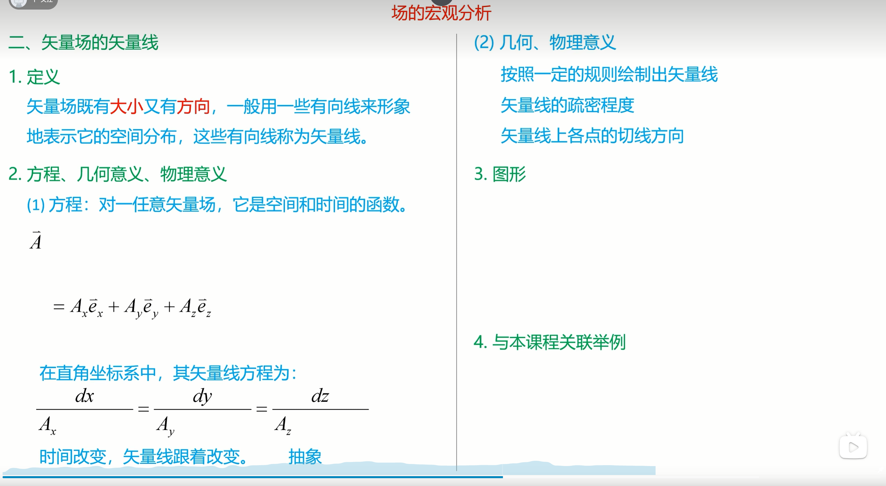

## 07-场的微观分析-梯度之导数

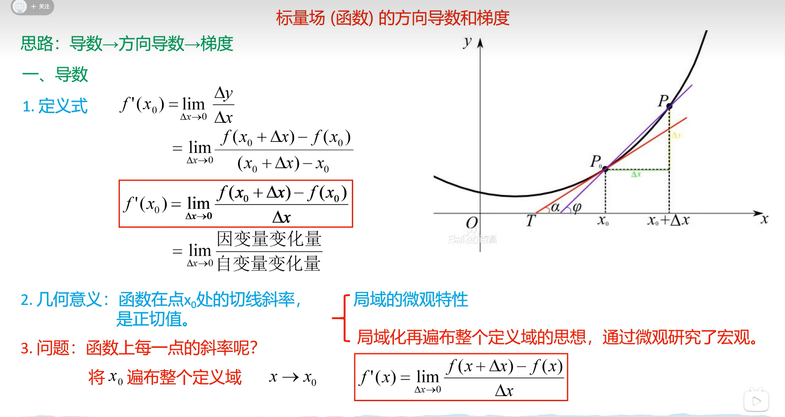

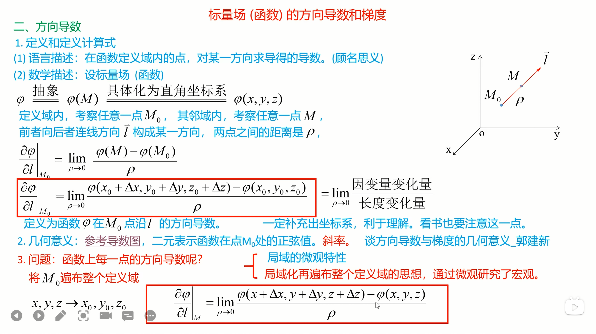

## 梯度的计算

自己推了一遍

用导数来记

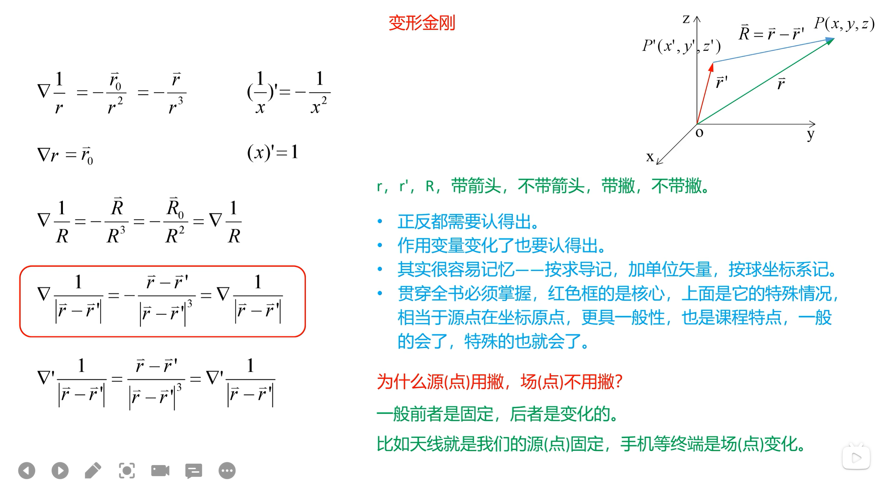

[梯度的计算思维导图](https://www.bilibili.com/video/BV1uV411H7xf?spm_id_from=333.788.player.switch&vd_source=1b09304cdddb6cdc468237b83577a3a9&p=28)
