[教程地址](https://www.bilibili.com/video/BV1L2rdB9ECo)

---

## 知识点

### 筛选器联合类型

```ts

type Circle{
  kind: "circle";
  radius: number;
}

type Square{
  kind: "square";
  slideLength: number;
}

type Shape = Circle | Square

```

```ts

// 使用分支语句收缩类型
if(s.kind === "circle"){
  s type is Circle
}else if(s.kind === "square"){
  s type is Square
}

```

## 小技巧

### switch true

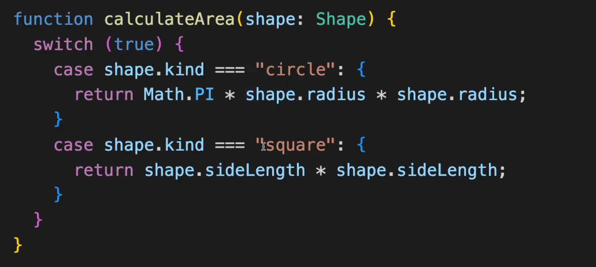

## 刷题

[type-challenges](https://github.com/type-challenges/type-challenges)

[视频教程](https://www.bilibili.com/video/BV1vY41187Tx)

学习方法：先用js函数写出来，再翻译成ts类型语法，遇到不会的就查，肯定:::
可以写出来，因为ts的类型语法是图灵完备的，记得总结用到的知识点

### easy-pick

#### easy-pick题目描述

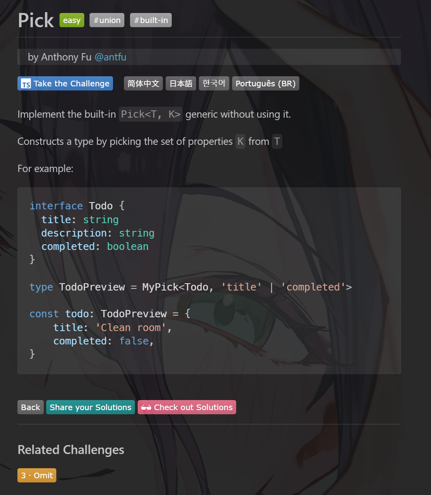

#### easy-pick答案

::: details 看答案

```ts
type MyPick<T, K extends keyof T> = {
  [P in K]: T[P]
}

// 刷题思路，先写JS函数，再翻译成TS类型
// function myPick(todo, keys) {
//   const obj = {};
//   keys.forEach(key => {
//     if (key in todo) {
//       obj[key] = todo[key];
//     }
//   });
//   return obj;
// }

/**
 * 1. 返回对象
 * 2. 遍历 keys mapped
 * 4. 判断 key 是否存在与 todo.keys()
 * 3. 取值 todo[key] indexed
 */
```

:::

#### easy-pick知识点

- [mapped文档](https://www.typescriptlang.org/docs/handbook/2/mapped-types.html#handbook-content)

- [indexed文档](https://www.typescriptlang.org/docs/handbook/2/indexed-access-types.html#handbook-content)

### easy-readonly

#### easy-readonly题目描述


#### easy-readonly答案

::: details 看答案

```ts
type MyReadonly<T> = {
  readonly [K in keyof T]: T[K]
}
```

:::

#### easy-readonly知识点

[readonly 修饰符](https://www.typescriptlang.org/docs/handbook/typescript-in-5-minutes-func.html#readonly-and-const)

### medium-readonly-2

#### medium-readonly-2题目描述

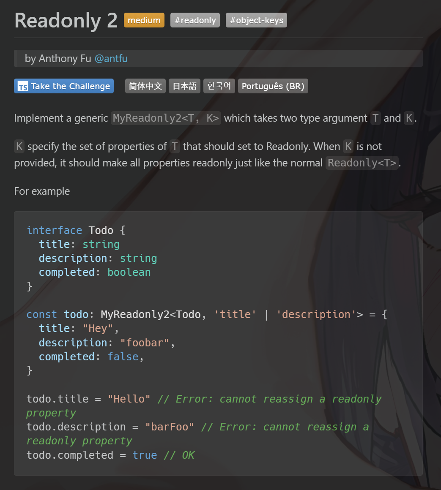

#### medium-readonly-2答案

::: details 看答案

```ts
//答案1
type MyReadonly2<T, K extends keyof T = any> = {
  readonly [P in keyof T as P extends K
    ? P
    : K extends never
      ? P
      : never]: T[P]
} & {
  [P in keyof T as P extends K ? never : P]: T[P]
}

//答案2
type MyReadonly2<T, K extends keyof T = keyof T> = {
  readonly [P in keyof T as P extends K ? P : never]: T[P]
} & {
  [P in keyof T as P extends K ? never : P]: T[P]
}
```

:::

#### medium-readonly-2知识点

`&`运算符的使用，用于合并类型
`any`的用处，用于匹配任意类型(any不一定就一定不好)
`类型参数的默认类型`,可以使用`任意`,用运算符算出来的也可以

### easy-tuple-to-object

#### easy-tuple-to-object题目描述

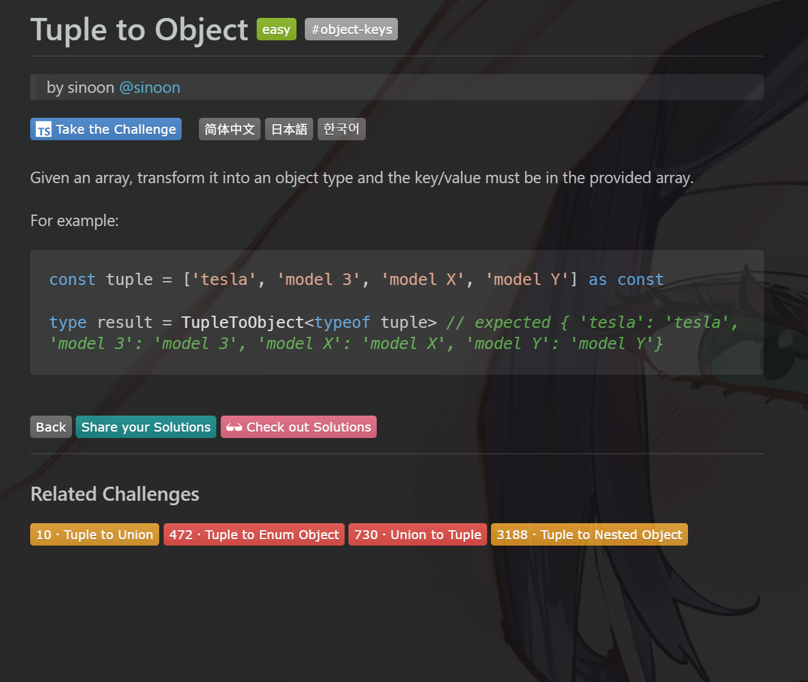

#### easy-tuple-to-object答案

::: details 看答案

```ts
type TupleToObject<
  T extends readonly (string | number | symbol)[],
> = {
  [P in T[number]]: P
}

// function tupleToObject(tuple) {
//   const obj: any = {};
//   for (const key in tuple) {
//     obj[tuple[key]] = tuple[key];
//   }
//   return obj;
// }
```

:::

#### easy-tuple-to-object知识点

[T[number]遍历数组](https://www.typescriptlang.org/docs/handbook/2/indexed-access-types.html#handbook-content)

### easy-first

#### easy-first题目描述

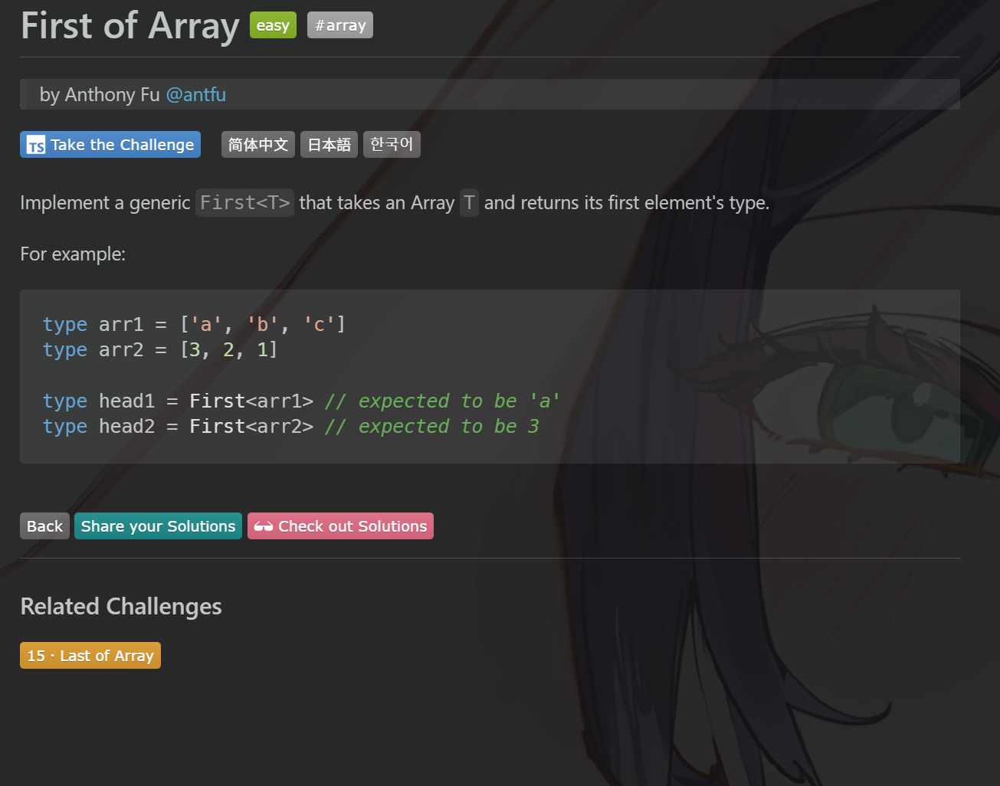

#### easy-first答案1

::: details 看答案1- extends undefined

```ts
type First<T extends any[]> = T['length'] extends 0
  ? never
  : T[0]
```

:::

#### easy-first答案2

::: details 看答案2-extends []

```ts
type First<T extends any[]> = T extends [] ? never : T[0]
```

:::

#### easy-first答案3

::: details 看答案3-infer

```ts
type First<T extends any[]> = T extends [infer F, ...any[]]
  ? F
  : never
```

:::

#### easy-first知识点

`T["length"]`可以获取传入的元组数组类型的长度

[extends作为条件判断](https://www.typescriptlang.org/docs/handbook/2/conditional-types.html)

### medium-last

#### medium-last题目描述

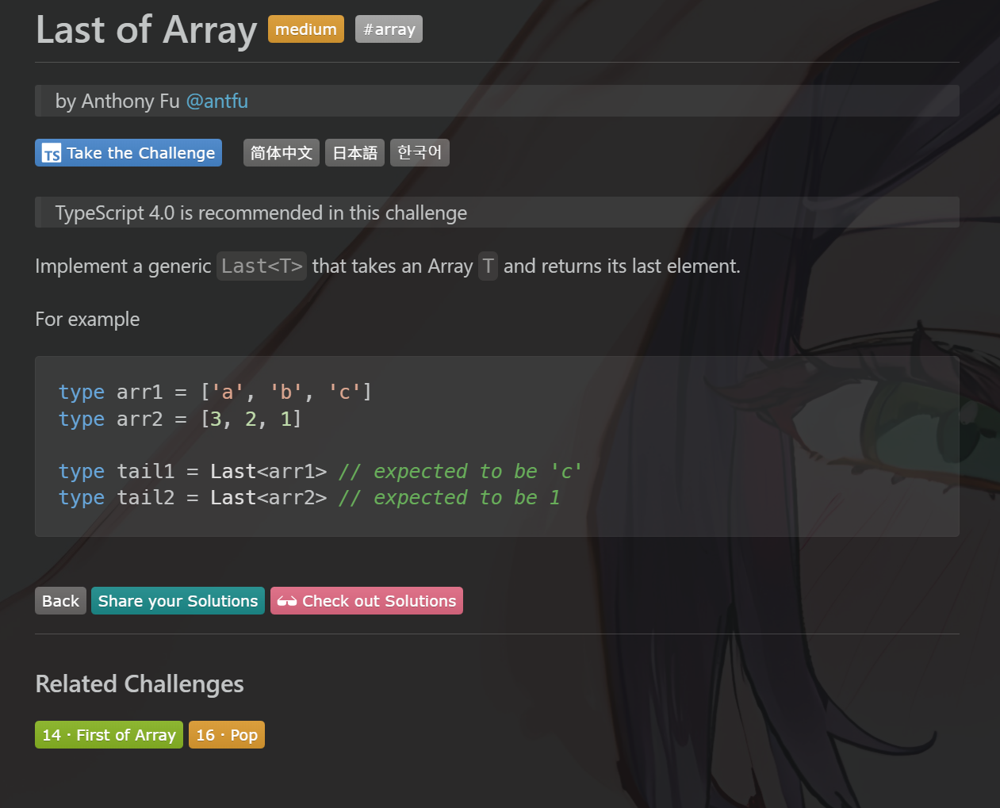

#### medium-last答案

::: details 看答案

```ts
type Last<T extends any[]> = T extends [...any[], infer L]
  ? L
  : never
```

:::

#### medium-last知识点

[infer提取类型](https://dev.to/leapcell/a-deep-dive-into-typescripts-infer-keyword-1o4b)

### medium-omit

#### medium-omit题目描述

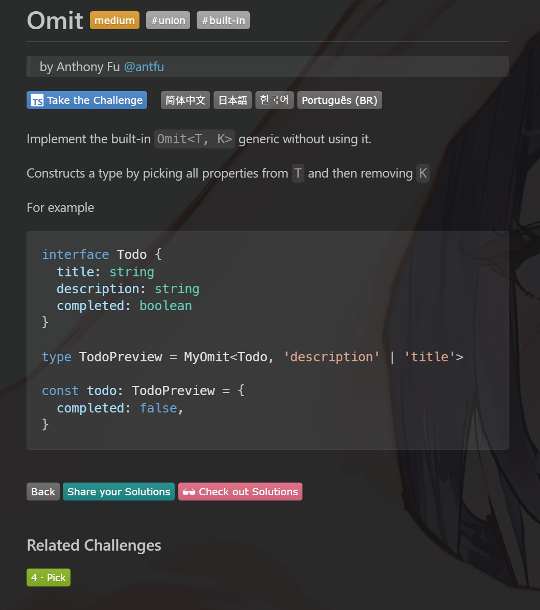

#### medium-omit答案

::: details 看答案

```ts
type MyOmit<T, K extends keyof T> = {
  [P in keyof T as P extends K ? never : P]: T[P]
}
```

:::

#### medium-omit知识点

如果as后面是never，则会忽略掉待as的P

### easy-tuple-length

#### easy-tuple-length题目描述

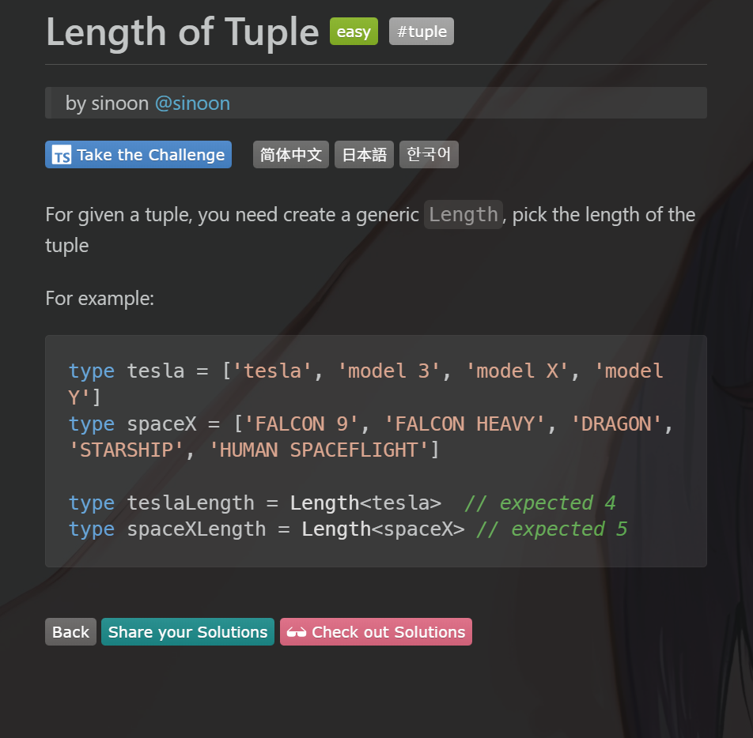

#### easy-tuple-length答案

::: details 看答案

```ts
type Length<T extends readonly any[]> = T['length']
```

:::

#### easy-tuple-length知识点

使用 `readonly any[]` 作为元组数组的约束

### easy-exclude

#### easy-exclude题目描述

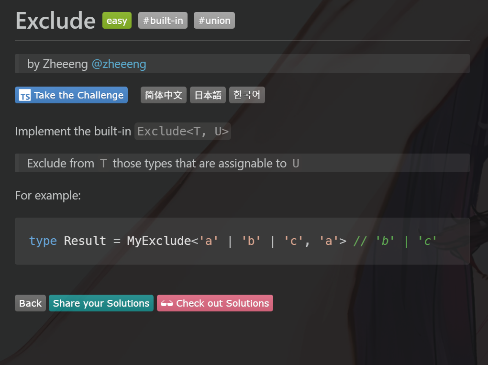

#### easy-exclude答案

::: details 看答案

```ts
type MyExclude<T, U> = T extends U ? never : T
```

:::

#### easy-exclude知识点

`分布式条件类型 (Distributive Conditional Types)`: `T extends U` , 当T是联合类型时，会启动`T.map(t=>t extends U)`来遍历T的所有类型是否与U相等，如果相等则返回 ? 后面的，而never | 任何类型都会返回never所以如果相等则直接从类型列表中剔除反之则返回自身

`'a' | never = never`

### easy-awaited

#### easy-awaited题目描述

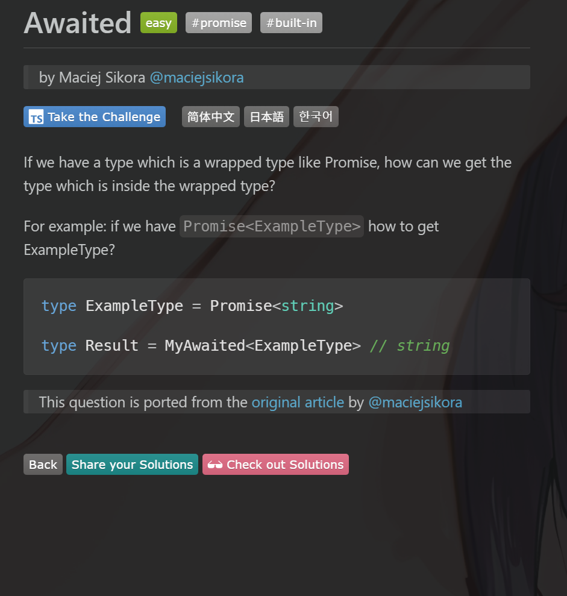

#### easy-awaited答案

::: details 看答案

```ts
type MyAwaited<T> = T extends {
  then: (onfulfilled: (arg: infer U) => any) => any
}
  ? MyAwaited<U>
  : T
```

:::

#### easy-awaited知识点

类型的递归写法, 以及`infer`的更高理解（提取参数类型）

### medium-pickbytype

#### medium-pickbytype题目描述

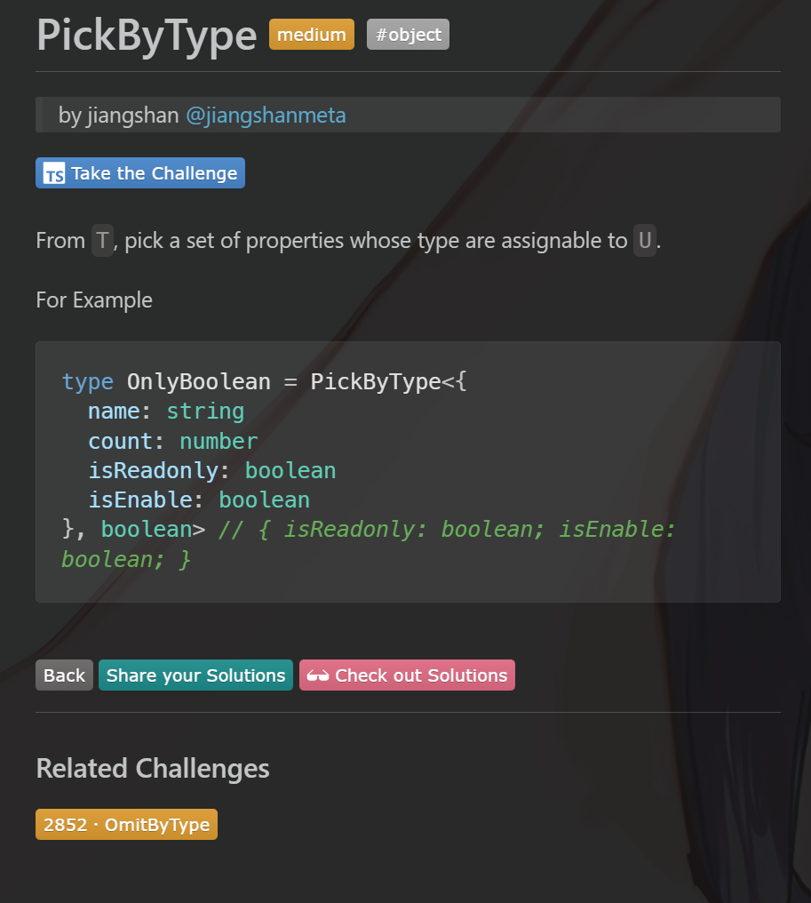

#### medium-pickbytype答案

::: details 看答案

```ts
type PickByType<T, U> = {
  [P in keyof T as T[P] extends U ? P : never]: T[P]
}
```

:::

#### medium-pickbytype知识点

`as`的用法，以及深刻理解在类型中`never的作用`

### easy-if

#### easy-if题目描述

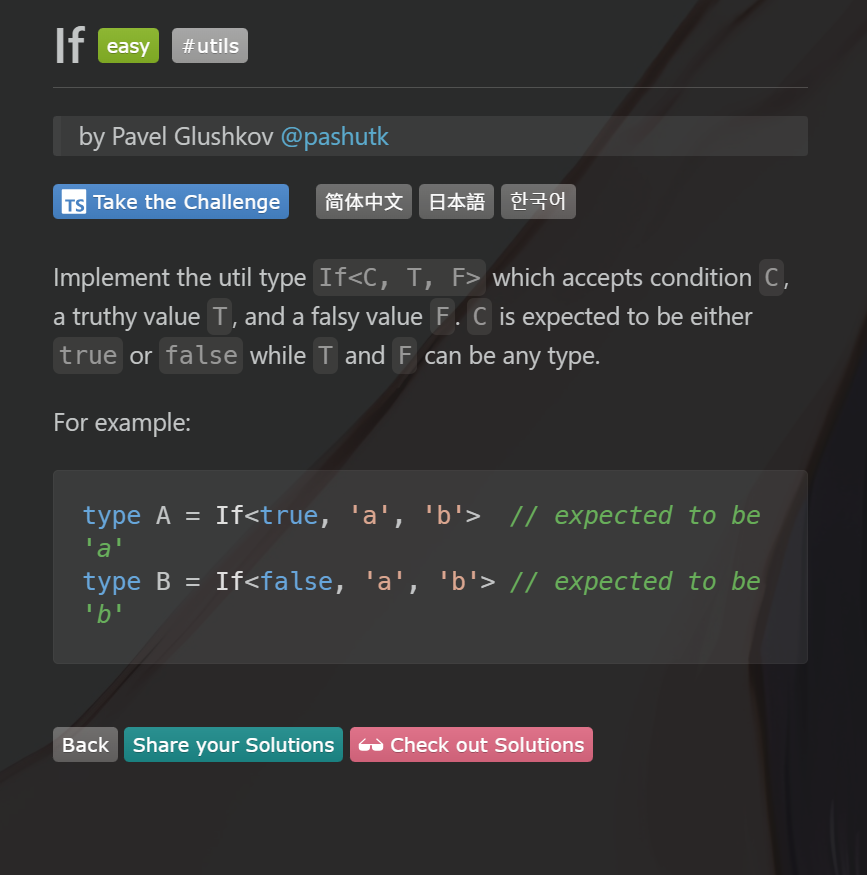

#### easy-if答案

::: details 看答案

```ts
type If<C extends boolean, T, F> = C extends true ? T : F
```

:::

#### easy-if知识点

`extends`的约束与逻辑判断双重用法

### easy-concat

#### easy-concat题目描述

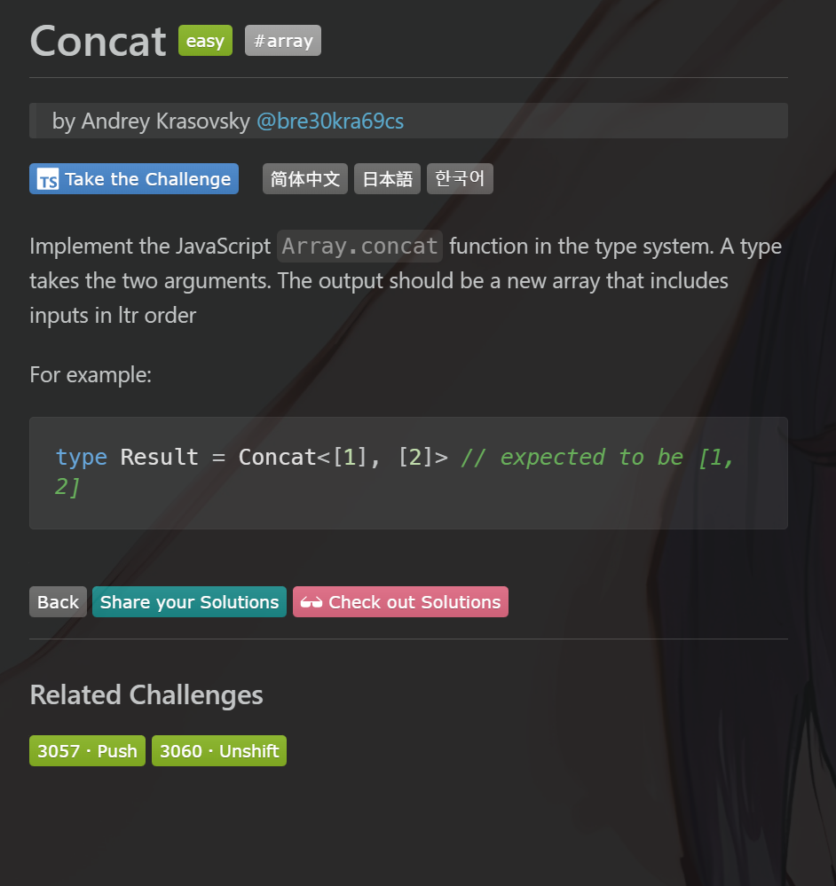

#### easy-concat答案

::: details 看答案

```ts
type Concat<
  T extends readonly any[],
  U extends readonly any[],
> = [...T, ...U]
```

:::

#### easy-concat知识点

`...T`与`T[number]`的区别

同样是"打开T"

`...T`的作用与js中相同，是完全且有序的展开T的所有类型

`T[number]`则是起到遍历T的作用

### easy-includes

#### easy-includes题目描述

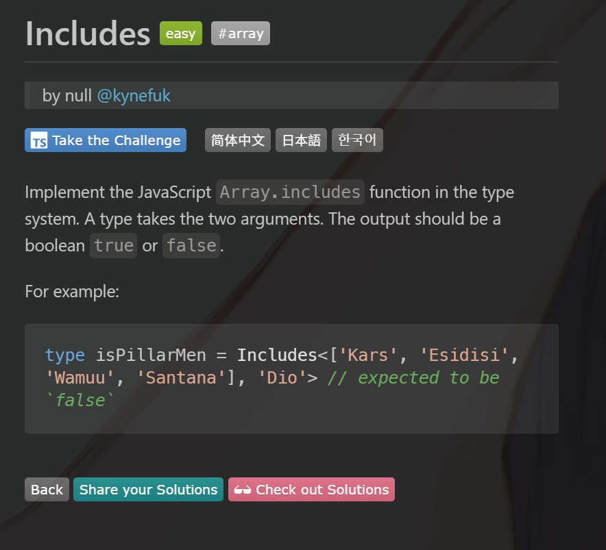

#### easy-includes答案1

::: details 看答案

```ts
type Equal<X, Y> =
  (<T>() => T extends X ? 1 : 2) extends <
    T,
  >() => T extends Y ? 1 : 2
    ? true
    : false

type Includes<T extends readonly any[], U> = T extends [
  infer F,
  ...infer R,
]
  ? Equal<U, F> extends true
    ? true
    : Includes<R, U>
  : false
```

:::

#### easy-includes答案2

::: details 看答案

```ts
type Equal<X, Y> =
  (<T>() => T extends X ? 1 : 2) extends <
    T,
  >() => T extends Y ? 1 : 2
    ? true
    : false

type Includes<T extends readonly any[], U> = {
  [P in keyof T]: Equal<T[P], U>
} extends false[]
  ? false
  : true
```

:::

#### easy-includes答案3

::: details 看答案

```ts
type Equal<X, Y> =
  (<T>() => T extends X ? 1 : 2) extends <
    T,
  >() => T extends Y ? 1 : 2
    ? true
    : false

type Includes<T extends readonly any[], U> = true extends {
  [P in keyof T]: Equal<T[P], U>
}[number]
  ? true
  : false
```

:::

#### easy-includes知识点

- 类型的递归调用，从0比较到最后一位，使用infer提取出每次递归的第一位类型
- 答案2、3: 整个mapping的遍历方式与比较方式

### easy-push

#### easy-push题目描述


#### easy-push答案

::: details 看答案

```ts
type Push<T extends any[], U> = [...T, U]
```

:::

#### easy-push知识点

`...`解构对象

### easy-unshift

#### easy-unshift题目描述


#### easy-unshift答案

::: details 看答案

```ts
type Unshift<T extends any[], U> = [U, ...T]
```

:::

#### easy-unshift知识点

`...`解构对象

### medium-return-type

#### medium-return-type题目描述

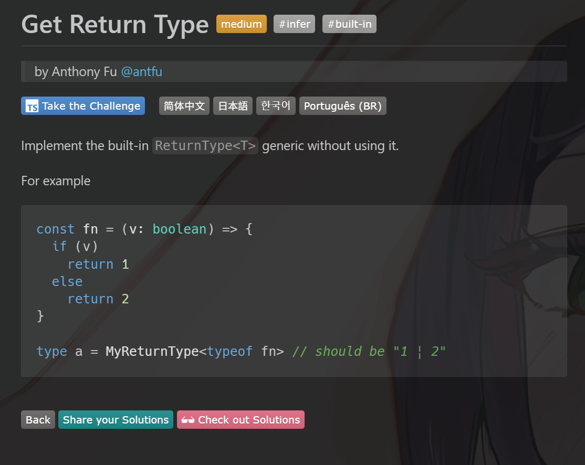

#### medium-return-type答案

::: details 看答案

```ts
type MyReturnType<T extends (...params: any[]) => any> =
  T extends (...params: any[]) => infer R ? R : never
```

:::

#### medium-return-type知识点

- 函数返回值的提取方式

- `infer`的用法

### medium-deep-readonly

#### medium-deep-readonly题目描述

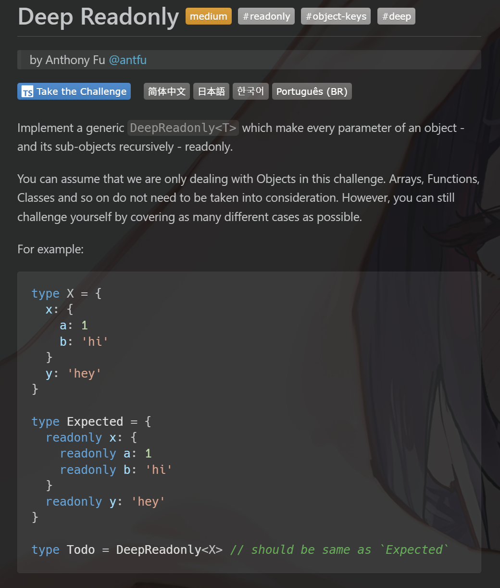

#### medium-deep-readonly答案

::: details 看答案

```ts
//答案1
type DeepReadonly<T> = {
  readonly [P in keyof T]: keyof T[P] extends never
    ? T[P]
    : DeepReadonly<T[P]>
}

//答案2
type DeepReadonly<T> = {
  readonly [P in keyof T]: T[P] extends Function
    ? T[P]
    : T[P] extends object
      ? DeepReadonly<T[P]>
      : T[P]
}
```

:::

#### medium-deep-readonly知识点

`keyof T`不仅可以拿到T的所有KEYS，还能用`keyof T extends never ? 原始类型 : 含key类型`判断一个类型是否是`KEY LIKE`类型，比如`数组`、`对象`、`MAP`、`SET`

### medium-tuple-to-union

#### medium-tuple-to-union题目描述

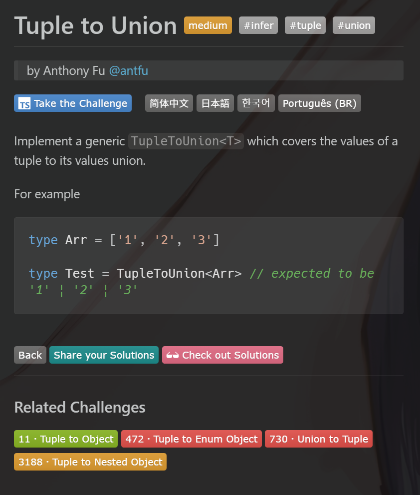

#### medium-tuple-to-union答案

::: details 看答案

```ts
//答案1
type TupleToUnion<T extends readonly any[]> = T[number]

//答案2
type TupleToUnion<T> = T extends Array<infer I> ? I : T
```

:::

#### medium-tuple-to-union知识点

- `T[number]`拆开数组/元组

- `Array<T>`的类型自动推断，TS会将[1,"hello"]元组的类型推断为`Array<number | string>`，进而可以用infer取出`number | string`

- `infer`从泛型中取出类型

### medium-chainable-options

#### medium-chainable-options题目描述

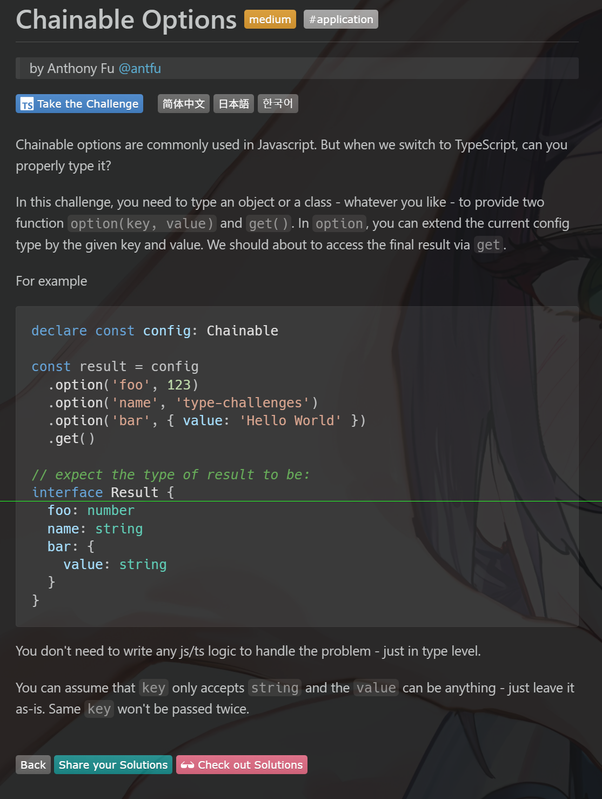

#### medium-chainable-options答案

::: details 看答案

```ts
type Chainable<T = {}> = {
  option<K extends string, V extends any>(
    key: K extends keyof T ? never : K,
    value: V,
  ): Chainable<MyOmit<T, K> & { [P in K]: V }>
  get(): T
}
```

:::

#### medium-chainable-options知识点

- 对象中函数的泛型定义，可以拿到具体的值类型
- [Omit](https://www.typescriptlang.org/docs/handbook/utility-types.html#omittype-keys) 剔除同键类型参数
- 不同类型的合并与覆盖、类型的递归复写

### medium-pop

#### medium-pop题目描述

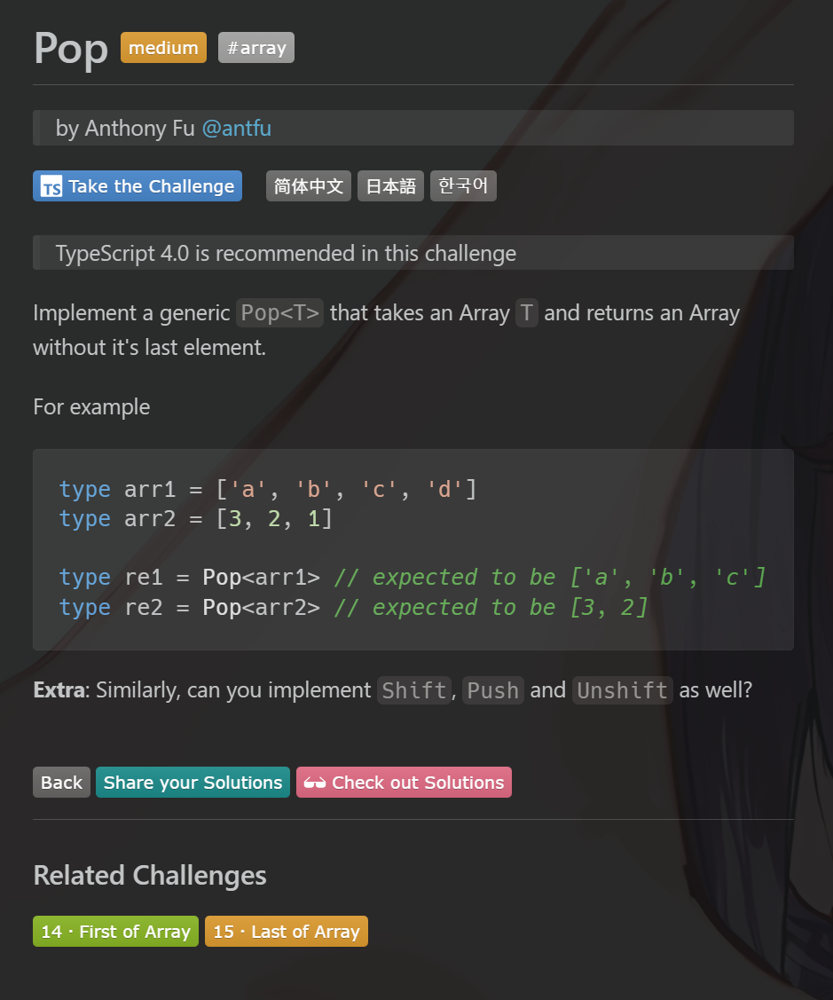

#### medium-pop答案

::: details 看答案

```ts
type Pop<T extends any[]> = T extends [...infer R, infer _]
  ? R
  : []
```

:::

#### medium-pop知识点

`infer`的作用

### medium-promise-all

#### medium-promise-all题目描述

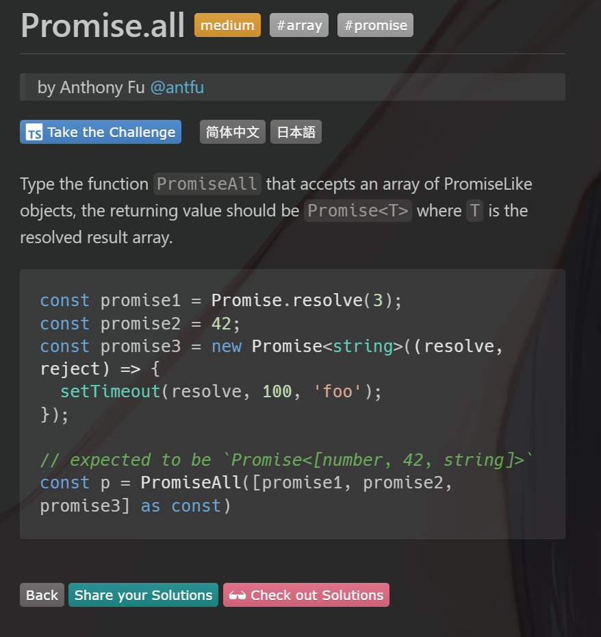

#### medium-promise-all答案

::: details 看答案

```ts
declare function PromiseAll<T extends any[]>(
  values: readonly [...T],
): Promise<{
  [P in keyof T]: MyAwaited<T[P]>
}>
```

:::

#### medium-promise-all知识点

`[P in keyof T]` 不仅能遍历对象，也能遍历数组
